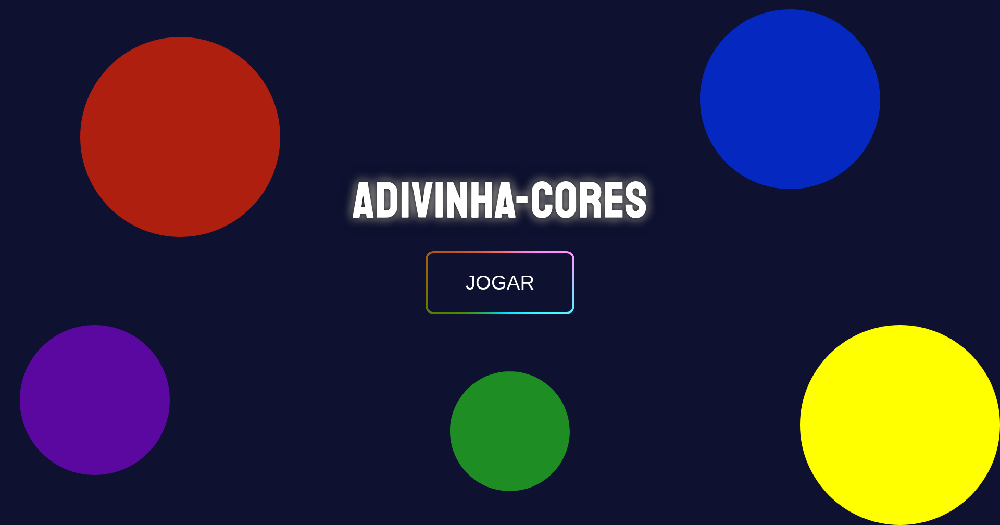
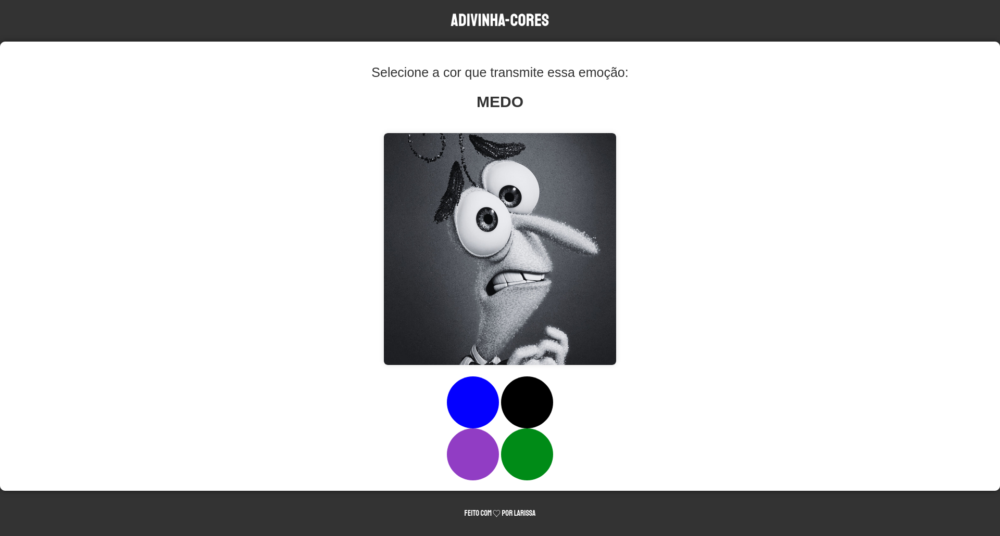

# Adivinha-Cores
# [Live preview](https://larissa022.github.io/Jogo-Divertidamente/index.html)

## About

Este projeto foi inicialmente desenvolvido para uma feira de cursos da escola, tendo como base o filme "Divertida Mente". Posteriormente, fui aprimorando-o para torná-lo mais interessante e divertido.

## To play?

Para jogar você só precisa clicar em um dos quatro botões disponíveis. Se você acertar, será redirecionado para a próxima página, mas se errar você retornará ao início do jogo para tentar novamente. O desafio é progredir clicando nos botões corretos, testando sua habilidade e concentração.

## Comments

Provavelmente farei algumas melhorias no futuro, então o projeto ainda não está totalmente finalizado.
